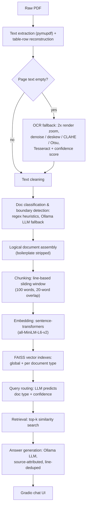

# pharma-doc-rag
RAG pipeline that splits multi-document pharmaceutical PDFs into logical sections, indexes them, and auto-routes questions to the right document type via a Gradio chat UI.

## Setup

Ollama (the LLM server) always runs directly on your machine — install it natively even if you use Docker for the rest of the app, since it's the piece that talks to your GPU. Pick your OS:

**macOS**
```bash
brew install ollama
```
(or download the installer from [ollama.com/download](https://ollama.com/download))

**Linux**
```bash
curl -fsSL https://ollama.com/install.sh | sh
```

**Windows**

Download and run `OllamaSetup.exe` from [ollama.com/download](https://ollama.com/download).

Then, on any OS, start the server and keep it running:
```bash
ollama serve                 # run this in a separate terminal, keep it running
```
The app pulls the model it needs automatically on first run (see `ensure_model_pulled()` in `pharma_rag/llm.py`) — you don't need to `ollama pull` manually. Set the `OLLAMA_MODEL` env var if you want a model other than the default `mistral` (e.g. `qwen2.5:7b-instruct`).

With Ollama running, choose one of the following ways to run the app itself:

### Option A: Docker (recommended for trying it out)

Requires [Docker](https://www.docker.com/products/docker-desktop/). This handles Python, Tesseract OCR, and all other app dependencies for you.

```bash
docker compose up --build
```
Launches the app at **http://localhost:7860**, connecting out to the Ollama server running on your host machine. Upload a pharmaceutical PDF and start asking questions.

Stop it with `Ctrl+C` (or `docker compose down`).

### Option B: Local Python venv (for development)

Requires **Python 3.10+** (`llama-index-core`'s dependencies use syntax that doesn't run on 3.9) and Tesseract OCR:
```bash
brew install tesseract        # macOS; see Tesseract docs for Linux/Windows
```

Create a virtualenv and install Python dependencies:
```bash
python3.10 -m venv .venv
source .venv/bin/activate
pip install -r requirements.txt
```

## Running it

```bash
./start.sh
```
Starts Ollama (if it isn't already running) and launches the app at **http://127.0.0.1:7860**. Upload a pharmaceutical blob PDF and start asking questions.

```bash
./stop.sh
```
Stops both the app and Ollama.

(`start.sh`/`stop.sh` are for the venv workflow above; with Docker, use `docker compose up`/`down` instead, and manage the native Ollama process yourself.)

## Configuration

Environment variables (all optional, see `pharma_rag/config.py`):

| Variable | Default | Purpose |
|---|---|---|
| `OLLAMA_HOST` | `http://localhost:11434` | Ollama server URL |
| `OLLAMA_MODEL` | `mistral` | Model to use for classification, routing, and answer generation |
| `EMBED_MODEL_NAME` | `all-MiniLM-L6-v2` | Sentence-transformers embedding model |

## Testing & Evaluation

Correctness here isn't just "does it run" -- for a pharma document pipeline, the questions that matter are "did it retrieve the right document" and "did the answer actually contain the right fact." This repo has two layers of testing:

**Unit tests** (`tests/eval_lib/`) are ordinary fast pytest tests for the scoring logic itself (answer matching, recall checks, bucket classification):
```bash
.venv/bin/python -m pytest tests/eval_lib/ -v
```

**The evaluation harness** (`tests/run_eval.py`) runs the *real* pipeline -- real Ollama LLM calls, no mocking -- against a set of realistic synthetic pharma documents (certificates of quality, packaging specs, BSE/TSE declarations, supplier records, both born-digital and scanned/OCR'd) checked into `tests/fixtures/`, alongside hand-written ground truth in `tests/ground_truth/` (expected facts, expected document type, expected source pages) for each question. For every case it runs the full `process_pdf` -> `query` flow and scores:

- **Answer Match %** -- do all expected facts appear in the generated answer
- **Retrieval Recall@k** -- did retrieval surface a chunk from the expected page range
- **Avg Latency** -- end-to-end query time
- **Error Rate** -- PDF-processing failures, unhandled exceptions, and detected LLM-generation failures

broken out separately for **digital** vs **scanned** documents, since OCR'd text is noisier and stresses the pipeline differently.

Snapshot from a recent run (15 cases across 6 fixtures, `mistral` via Ollama) -- numbers will shift slightly run to run since the LLM isn't deterministic:

| | Digital | Scanned | Overall |
|---|---|---|---|
| Answer Match % | 92% | 100% | 93% |
| Retrieval Recall@4 | 92% | 100% | 93% |
| Avg Latency (s) | 4.5 | 2.2 | 4.2 |
| Error Rate | 0% | 0% | 0% |

The one recurring miss is a case where the model answers from an adjacent-but-wrong fact (an operating temperature instead of a storage temperature) rather than a retrieval or infrastructure failure -- the per-case JSON output records enough detail (including whether the retrieved sources matched the expected document type) to distinguish that kind of miss from a doc-type misroute or a dropped source.

To run it yourself:
```bash
.venv/bin/python tests/run_eval.py     # requires Ollama running, same as the app
```
This makes real LLM calls against every fixture, so a full run takes several minutes -- it's an evaluation suite, not a fast unit-test suite. Results are written as a timestamped JSON file to `tests/results/` (gitignored -- it's run output, not source).

`tests/fixtures/` and `tests/ground_truth/` are already committed, so `tests/generate_fixtures.py` normally doesn't need to be re-run -- it exists so the fixtures can be regenerated or audited if their content ever needs to change.

## Project Layout

```
start.sh                         # starts Ollama (if needed) and the app
stop.sh                          # stops the app and Ollama
main.py                          # entry point: launches the Gradio app
pharma_rag/
  config.py                      # constants and env-var configuration
  llm.py                         # Ollama-backed llm_generate() + JSON extraction
  schemas.py                     # PageInfo / LogicalDocument / ChunkMetadata dataclasses
  document_intelligence.py       # heuristic + LLM document classification and boundary detection
  pdf_processing.py              # PDF text extraction, OCR pipeline, text cleaning
  chunking.py                    # sliding-window and LlamaIndex-based chunking
  retrieval.py                   # embeddings, FAISS vector indexes, query routing
  answer_generation.py           # source-attributed answer generation
  document_store.py              # EnhancedDocumentStore: ties the pipeline together
  ui.py                          # Gradio Blocks interface, theme, and CSS
tests/
  run_eval.py                    # evaluation harness: runs the real pipeline against fixtures
  generate_fixtures.py           # (re)generates tests/fixtures/ and tests/ground_truth/
  eval_lib/
    metrics.py                   # answer matching, recall, and scoring logic
    report.py                    # aggregates per-case results into the summary table
  fixtures/                      # synthetic pharma PDFs (digital + scanned) used as test input
  ground_truth/                  # expected facts/doc type/pages per fixture, as JSON
  results/                       # timestamped JSON output from eval runs (gitignored)
```

## System Overview & Architecture



1. **PDF ingestion & text extraction** — `pymupdf` (`fitz`) opens the PDF and extracts each page's text, reconstructing table rows (via word y-position line clustering + gap-based column splitting, `pharma_rag/pdf_processing.py`) into single `[TABLE]`-wrapped lines instead of PyMuPDF's default one-line-per-cell output.
2. **OCR fallback** — for pages with no extractable text, the page is rendered at 2x zoom (~144 DPI), preprocessed with OpenCV (denoise, deskew, CLAHE contrast, Otsu binarization), and run through `pytesseract`, which also reports a mean per-word confidence score, flagged when below `MIN_OCR_CONFIDENCE` (60).
3. **Text cleaning** — Unicode normalization, control-character stripping, and whitespace collapsing are applied to every page (native or OCR'd) before classification, without touching structural markers boundary detection still needs (e.g. "Page 2 of 2").
4. **Document classification & boundary detection** — each page is matched against ordered regex title/keyword patterns (`document_intelligence.py`); pages the heuristic can't confidently label fall back to a local Ollama LLM call (`OLLAMA_MODEL`, default `mistral`) for classification and same-/different-document boundary judgments.
5. **Logical document assembly** — consecutive same-document pages are joined into a `LogicalDocument`, with repeated page-footer/header boilerplate (e.g. "Page 2 of 2", bare page numbers) stripped once boundaries are final.
6. **Chunking** — a custom sliding window over whole lines (`chunk_size=100` words, `overlap=20` words, `chunking.py`) splits each logical document into `ChunkMetadata` records; a line only splits mid-line if it alone exceeds `chunk_size`, so a table row's cells stay together.
7. **Embedding & indexing** — chunk text is embedded with `sentence-transformers` (`EMBED_MODEL_NAME`, default `all-MiniLM-L6-v2`) and added to both a global FAISS `IndexFlatL2` index and a per-document-type index.
8. **Query routing** — an incoming question is classified by the LLM into a predicted document type + confidence (JSON output); the type-specific FAISS index is only used above a 0.7 confidence threshold, otherwise the global index is searched.
9. **Retrieval** — the top-`k` (default `k=4`) nearest chunks are retrieved by L2 distance and converted to a 0–1 relevance score (`max(0, 1 - distance/2)`).
10. **Answer generation** — retrieved chunks are grouped by source document, de-duplicated line-by-line to avoid double-counting content repeated across overlapping chunks, and sent to the Ollama LLM (temperature 0.1) in one prompt that must cite document type and page range.
11. **UI** — a Gradio `Blocks` app (`ui.py`) displays the detected document structure, lets the user filter by doc type or toggle auto-routing, and renders chat answers with per-source relevance and previews.

## Why this isn't just another RAG chatbot

Most "chat with your PDF" demos assume one PDF is one document, embed it, and call it done. That assumption breaks immediately in pharma operations, where a single upload is routinely a scanned bundle of unrelated records — a certificate of analysis, a BSE/TSE declaration, a packaging spec, a supplier letter — stapled together into one PDF because that's how the file arrived. A generic RAG pipeline embeds that bundle as one undifferentiated blob and lets nearest-neighbor search sort out the mess at query time. This repo doesn't skip that problem, it's the problem the pipeline is built around:

- **It splits before it indexes.** Boundary detection (`document_intelligence.py`) figures out where one logical document ends and the next begins *inside a single PDF*, using ordered regex heuristics with an LLM fallback for the pages the heuristics can't call confidently — so a 12-page upload containing four unrelated records becomes four `LogicalDocument`s, not one.
- **It routes queries by document type, not just by vector similarity.** Retrieval isn't a single flat index — there's a global FAISS index and a per-document-type index, and an LLM classifies each incoming question into a predicted type + confidence before deciding which index to search (`retrieval.py`). "What's the storage temperature?" and "What's the BSE/TSE risk classification?" should never be competing for the same nearest-neighbor slots.
- **It treats scanned pages as a first-class input, not an edge case.** Pages with no extractable text get OCR'd through a real preprocessing pipeline (denoise, deskew, CLAHE, Otsu binarization) with a per-word confidence score, and the eval harness tracks digital vs. scanned accuracy *separately* — because in this domain, half your documents showing up as low-quality scans isn't a corner case, it's Tuesday.
- **It reconstructs tables instead of shredding them.** PyMuPDF's default cell-per-line extraction destroys row structure; this pipeline reconstructs rows via word y-position clustering before chunking, and the chunker itself refuses to split a table row across chunks even if it's the one line that exceeds the chunk size.
- **It's graded on facts.** There's a real evaluation harness (`tests/run_eval.py`) that runs the actual pipeline — no mocked LLM calls — against hand-labeled ground truth and reports Answer Match %, Retrieval Recall@k, and doc-type misroutes as distinct failure modes, broken out by digital vs. scanned. "It looks like it works" isn't the bar; a per-case JSON trail showing *which* stage failed is.

The net effect: this is less "embed a PDF and ask GPT about it" and more a small document-intelligence system — segmentation, classification, and routing — with RAG as the retrieval layer sitting on top, purpose-built for the fact that pharma PDFs are usually several different regulated documents wearing one file extension.